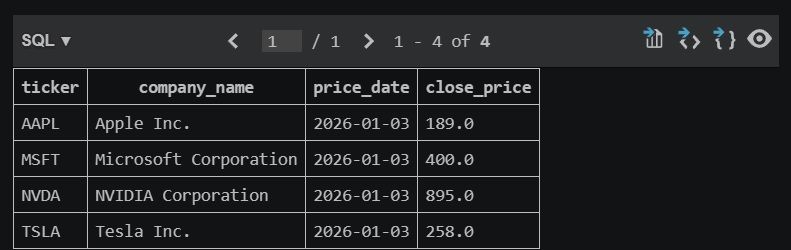
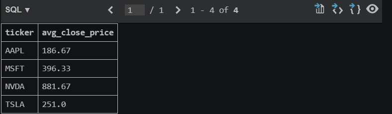
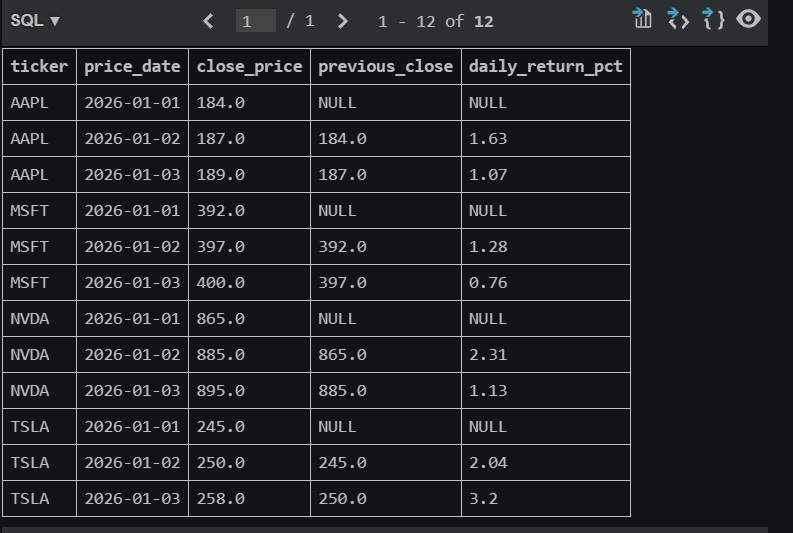
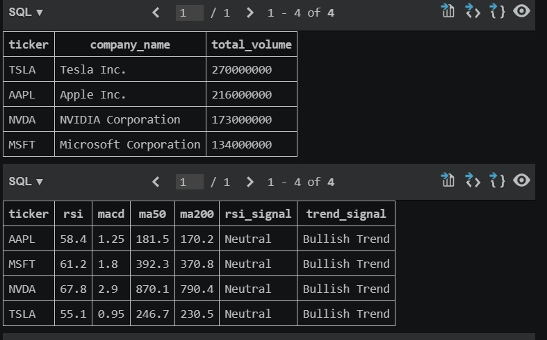
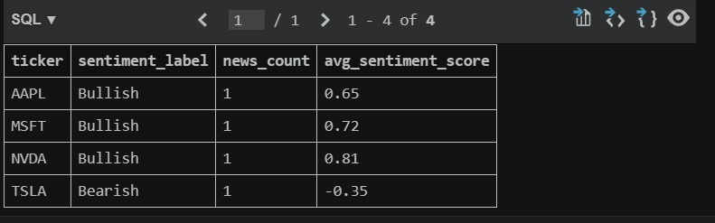
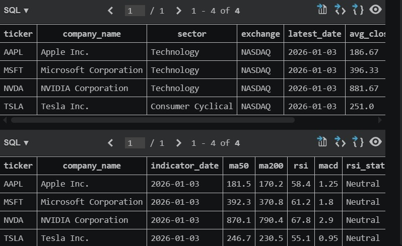

# 📈 SQL Stock Market Data Warehouse

A financial market data warehouse built with SQL and SQLite for stock market analytics, technical analysis, and business intelligence reporting.

This project simulates a real-world financial analytics environment by integrating stock prices, technical indicators, and news sentiment data into a structured relational database.

---

## 🚀 Features

- Financial data warehouse architecture
- Historical stock price analysis
- Technical indicator tracking (RSI, MACD, Moving Averages)
- News sentiment analysis
- Advanced SQL analytics queries
- SQL Views for reporting and dashboarding
- Business Intelligence-ready dataset

---

## 📊 Database Schema

### Companies
Stores company master data:

- Ticker
- Company Name
- Sector
- Exchange

### Stock Prices
Stores historical market data:

- Open Price
- High Price
- Low Price
- Close Price
- Trading Volume

### Technical Indicators
Stores technical analysis metrics:

- RSI
- MACD
- MACD Signal
- 50-Day Moving Average
- 200-Day Moving Average

### News Sentiment
Stores financial news sentiment information:

- Sentiment Score
- Sentiment Label
- Headlines

---

## 📈 Financial Analytics Performed

### Latest Closing Price by Company

Retrieves the most recent stock closing price.

### Average Closing Price Analysis

Calculates average stock performance over time.

### Daily Return Calculation

Measures percentage daily stock returns.

### Technical Signal Detection

Identifies bullish and bearish technical setups using RSI and MACD.

### News Sentiment Analysis

Evaluates market sentiment for individual companies.

---

## 📋 SQL Concepts Demonstrated

- Relational Database Design
- Primary & Foreign Keys
- Multi-table JOINs
- Aggregate Functions
- GROUP BY Analysis
- CASE Statements
- SQL Views
- Financial KPI Calculations
- Business Intelligence Reporting

---

## 📸 Query Results

### Latest Closing Price

### Average Closing Price

### Daily Returns

### Technical Signals

### News Sentiment

### SQL Views

---

## 🛠 Technologies

- SQL
- SQLite
- Financial Data Modeling
- Git
- GitHub

---

## 👨‍💻 Author

**Cosmin-Gabriel Chiriță**

Financial Analytics • Business Intelligence • SQL • Python • AI